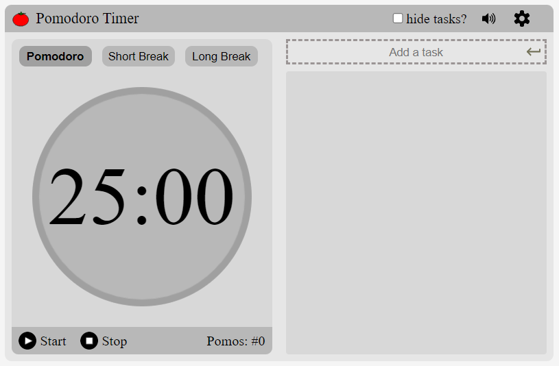

## 
 Pomodoro Tool

* Projeto Publicado: https://www.pomodoro.dailysimpletools.com

## Descrição do projeto
Pomodoro é uma técnica de estudos com o objetivo de ter mais foco, e consequentemente, ser mais produtivo na realização e/ou aprendizado de tarefas complexas e dificeis. A ideia de desenvolver essa aplicação surgiu como uma ideia de criar meu portfólio pessoal, e ao mesmo tempo disponibilizar, tanto para mim quanto para toda a comunidade, uma ferramenta útil para facilitar a utilização dessa técnica. 

## Funcionalidades
* Temporizador pomodoro;
* Lista de tarefas a serem realizadas;
  * Opção de concluir e/ou deletar tarefas
* Configurações personalizadas dos intervalos;

## Técnologias utilizadas
*  
* 
* 

## Autores
| [ Diego Ferreira](https://github.com/diegonf) | 
| :---: |